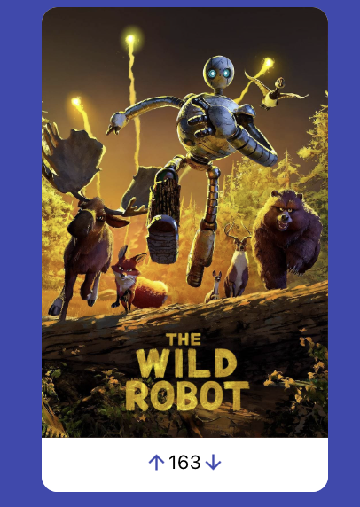

# Rancid Tomatillos

### [The deployed app can be found here.](https://https://rancid-tomatillos-u5bo.onrender.com/)

## Overview 
Rancid Tomatillos is a React-based web application designed to mimic a movie review platform.

This project was planned using Excalidraw and GitHub projects, built using React, tested using Cypress, and deployed using Render, all on macOS. 

## Installation Instructions
-   First, clone the repository to your local machine using the following command: `git clone https://github.com/mhaefling/rancid-tomatillos.git`
-   Navigate into the project directory: `cd rancid-tomatillos`
-   Install the required dependencies into the project directory: `npm install`
-   Start the development server: `npm start`
-   Once the server is running, navigate to `http://localhost:3000`
-   To run Cypress tests, use `npx cypress open`
-   Enter `control + c` in your terminal to stop running the React server at any time

## Usage Instructions

### 1. View All Movies

- When you first visit the app, you'll be shown a list of all available movies.
- Each movie will display the following information:
  - The movie poster
  - The number of upvotes for each movie

### 2. Upvoting and Downvoting

- Each movie card will have **Upvote** and **Downvote** buttons.
- **Upvote**: Click the up arrow on a movie card to increase its vote count by 1. The movie’s vote will update instantly on the card.
- **Downvote**: Click the down arrow on a movie card to decrease its vote count by 1. The movie’s vote will update instantly on the card.

### 3. View Movie Details

- You can click on any movie to view more details about it.
- The movie details page will display:
  - The movie’s backdrop image
  - List of genres
  - Overview
  - To return to the main view of all movies, click the **Home button** or back arrow on your browser. 
